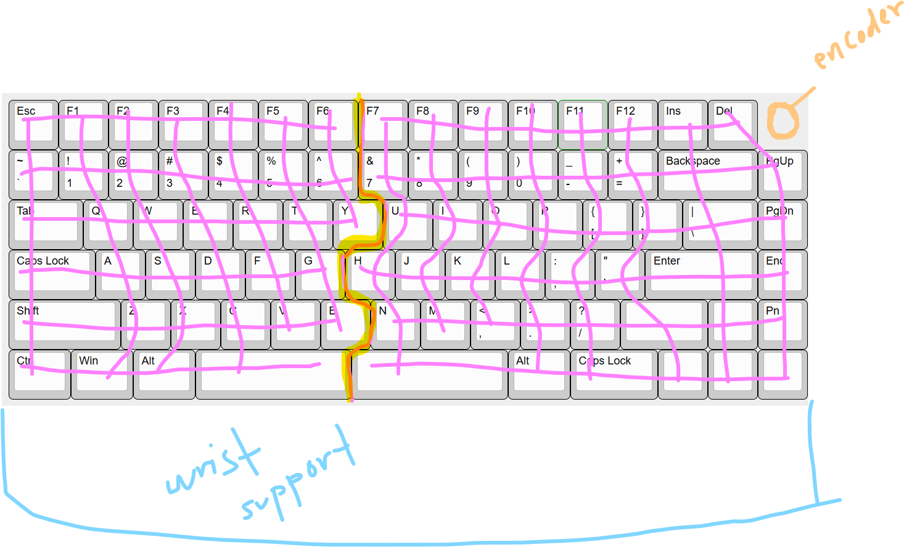

### July 3

~ 1.5 hours

Today I started going through what layout I wanted for my keeb. I went through and found some nice designs here. I found that I kind of liked the puzzle piece layout of the mistel baracco and I wanted to add foam or something for wrist comfort - I’m not entirely sure how aesthetic this is going to turn out, I’ll have to wait and see. I was originally planning on using two picos for mcu’s, one on each half of the split keyboard. However, that would have meant using a separate bluetooth module, one, again, for each half of the keeb. But then I learned about nice!nano’s, and now all is not lost. 

I spent a little bit working on the initial matrix that I planned to use:

I don’t think I want neopixels for rgb so I might just use diodes for back light instead. Also for space conservation and so that the keyboard doesn’t look bulky and awkward, I might extend a little bit of the case outwards and downwards into the wrist support to fit the nice!nanos. The foam/wood or whatever will cover this protruding section.