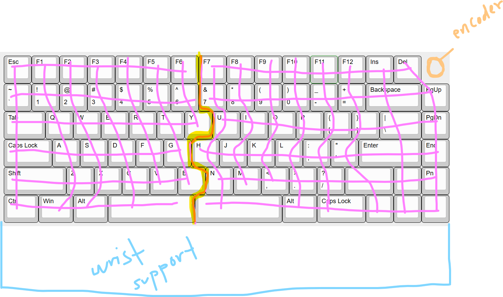

# July 3

~ 1.5 hours

Today I started going through what layout I wanted for my keeb. I went through and found some nice designs here. I found that I kind of liked the puzzle piece layout of the mistel baracco and I wanted to add foam or something for wrist comfort - I’m not entirely sure how aesthetic this is going to turn out, I’ll have to wait and see. I was originally planning on using two picos for mcu’s, one on each half of the split keyboard. However, that would have meant using a separate bluetooth module, one, again, for each half of the keeb. But then I learned about nice!nano’s, and now all is not lost. 

I spent a little bit working on the initial matrix that I planned to use:

I don’t think I want neopixels for rgb so I might just use diodes for back light instead. Also for space conservation and so that the keyboard doesn’t look bulky and awkward, I might extend a little bit of the case outwards and downwards into the wrist support to fit the nice!nanos. The foam/wood or whatever will cover this protruding section.

# July 4

~ 5 hours

So today I did a little bit more of thorough research on the parts I wanted to use and came up with this tentative list:

Nice!nano x 2
Cherry mx brown switches x 83
PBT OEM keycaps for mx style switches x 83
EC11 Rotary Encoder x 1 (might later look into a keycap set that includes the cap for the encoder)
Encoder Cap x 1

So I was having second thoughts about my design - everything seems fine but the nice!nano’s are a little big and fitting them on the top of the pcb would create a large, bulky, and awkward looking spot at the top which I would have to fix by adding an oled screen or something. This is one of the reasons why I had added the wrist support in the first place. However, if I wanted to remove the wrist support while using the keeb, the space holding the mcus would stick out again in a large, bulky and awkward way. To remedy this, once I start cad I'm planning on creating a diagonal plane from the edge of the keyboard downwards to make a smoother section off of which to balance the wrist. 

Also cool thought for later - might add a not too strong magnet to the ‘split’ section in the keeb so that if I wanted to join the two ends, I could do so without them shifting too much while I’m typing - kind of want to make the joined ends seem seamless when pushed together.

So I worked for 3 hours, scrapped ideas multiple times and am semi-done with schematic. Still have to finish the li-po battery stuff and a power on/off switch. Also thinking of creating two separate pcb files for the two separate sides because I tried out hierarchical sheets and it got a little messy. 

I was a little bit worried about the high vs low frequency pins on the n!n. I had wired the left side first and was able to fit all the rows and columns under the low freq pins, however, when it came to the right hand side, which is slightly larger than the left - I was forced to use the high frequency pins (made an oopsie in between and accidentally used vcc thinking it was a gpio). Turns out it doesn’t make too much difference in that there won’t be too much trouble when it comes to firmware and performance.
